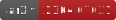
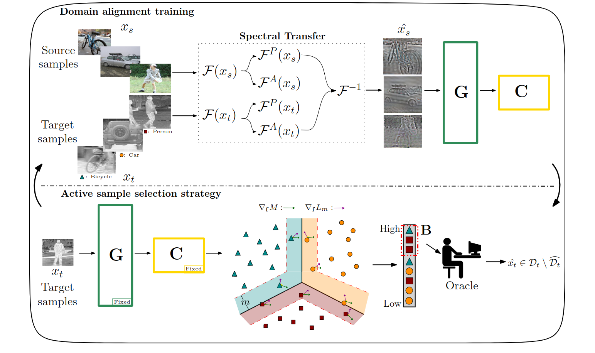

# Spectral Transfer Guided Active Domain Adaptation for Thermal Imagery


If you make use of this code, please cite the following paper (and give us a star :sparkles:):
```bibtex
@InProceedings{stgada2023,
    author    = {Ustun, Berkcan and Kaya, Ahmet Kagan and Cakir Ayerden, Ezgi and Altinel, Fazil },
    title     = {Spectral Transfer Guided Active Domain Adaptation for Thermal Imagery},
    booktitle = {Proceedings of the IEEE/CVF Conference on Computer Vision and Pattern Recognition (CVPR) Workshops},
    month     = {June},
    year      = {2023},
    pages     = {4322-4331}
}
```

[](https://arxiv.org/abs/2304.07031)

## Overview
This repository contains official implementation of "[Spectral Transfer Guided Active Domain Adaptation for Thermal Imagery](https://arxiv.org/abs/2304.07031)" paper (accepted to CVPR 2021 [Perception Beyond the Visible Spectrum (PBVS)](https://pbvs-workshop.github.io/) workshop).

<p align="center">
  
</p>

## Environment
- Python 3.7
- Pytorch 1.8.0
- torchvision 0.9
- Numpy 1.20


## Dataset Preparation
- Download FLIR ADAS dataset: [Link](https://www.flir.eu/oem/adas/adas-dataset-form/)
- Download MS-COCO dataset: 
  - [Train images](http://images.cocodataset.org/zips/train2017.zip) 
  - [Val images](http://images.cocodataset.org/zips/val2017.zip) 
  - [Train/Val annotations](http://images.cocodataset.org/annotations/annotations_trainval2017.zip)
- After you downloaded the datasets, prepare the dataset .txt files similar to the files in 'RGB' folder and put them in that folder.


## Running
1. Modify the 'ini.config' file.
2. To train STGADA, run the command below.
```bash
(stgada) $ python run.py 
```

| Parameter Name    | Type    | Definition                              |
|:------------------|:--------|:----------------------------------------|
| `[path]`          | `str`   | Path to the txt files                   |
| `[source]`        | `str`   | Name of the Source dataset              |
| `[target]`        | `str`   | Name of the Target dataset              |
| `[target_test]`   | `str`   | Name of the Target Test dataset         |
| `[lr]`            | `float` | Learning rate                           |
| `[batch]`         | `int`   | Batch size                              |
| `[stgada_lambda]` | `float` | Lambda parameter                        |
| `[stgada_margin]` | `float` | Margin parameter                        |
| `[l]`             | `float` | l parameter of FDA (the beta parameter) |
| `[device]`        | `int`   | GPU device ID                           |
- Log

We also provide our experiment logs saved in `RGB_result/{dataset_source}_{dataset_target}.log`. For example, `mscoco_flir.log`
and the best model along with the models saved after the active epochs.

## Acknowledgement
This repo is mostly based on:
- "https://github.com/TencentYoutuResearch/ActiveLearning-SDM"
